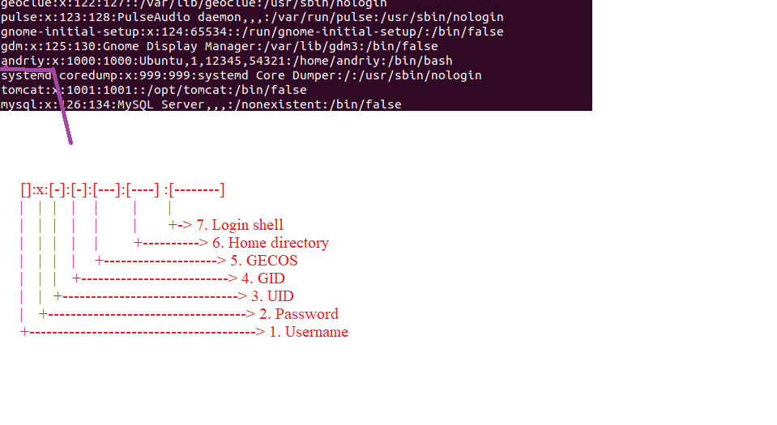
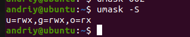

#Task5.2
Task assignment.

1) Analyze the structure of the /etc/passwd and /etc/group file, what fields are
present in it, what users exist on the system? Specify several pseudo-users, how
to define them?

2) What are the uid ranges? What is UID? How to define it?

3) What is GID? How to define it?

4) How to determine belonging of user to the specific group?

5) What are the commands for adding a user to the system? What are the basic
parameters required to create a user?

6) How do I change the name (account name) of an existing user?

7) What is skell_dir? What is its structure?

8) How to remove a user from the system (including his mailbox)?

9) What commands and keys should be used to lock and unlock a user account?

10) How to remove a user's password  and provide him with a password-free
login for subsequent password change?

11) Display the extended format of information about the directory, tell about
the information columns displayed on the terminal.

*splays permissions links owner group size time name  

12) What access rights exist and for whom (i. e., describe the main roles)?
Briefly describe the acronym for access rights.

Filetype(permision of user'owner')(permision of the gruop)(per.. of the other users)
*rwx read-write-execute (read=4, write=2, execute=1 : rw-=6 r-x=5 -wx=3 rwx=7 )

13) What is the sequence of defining the relationship between the file and the
user?
Filetype(permision of user'owner')(permision of the gruop)(per.. of the other users)

14) What commands are used to change the owner of a file (directory), as well
as the mode of access to the file? Give examples, demonstrate on the terminal.

15) What is an example of octal representation of access rights? Describe the
umask command.

everything is calculated quite simply, the mask is taken away from the maximum rights and the rights for the file are obtained. In fact, it turns out that the mask contains permissions that will not be set for the file. Therefore, the default permissions for the file will be 666 - 002 = 664, and for the directory - 777 - 002 = 775.

16) Give definitions of sticky bits and mechanism of identifier substitution. Give
an example of files and directories with these attributes.

sticky bit. This permission is useful for protecting files from accidental deletion in an environment where multiple users have write access to the same directory. If the sticky bit is applied, the user can delete the file only if he is the user who owns the file or directory that contains the file. For this reason, it is used as the default permission for the / tmp directory and can be useful for general group directories as well. t is a flag of sticky bit.

17) What file attributes should be present in the command script?

    a - append only: File can only be opened for appending.
    
    c - compressed: Enable filesystem-level compression for the file.
    
    e -  denotes that the file is using extents for mapping the blocks on disk.
    
    i - immutable: Cannot be modified, deleted, renamed, linked to. Can only be set by root.
    
    j - data journaling: Use the journal for file data writes as well as metadata.
    
    m - no compression: Disable filesystem-level compression for the file.
    
    A - no atime update: The file's atime will not be modified.
    
    C - no copy on write: Disable copy-on-write, for filesystems that support it.

   

