#Part1

1. How many states could has a process in Linux?

    *Running or Runnable (R)
    *Uninterruptible Sleep (D)
    *Interruptable Sleep (S)
    *Stopped (T)
    *Zombie (Z)

2. Examine the pstree command. Make output (highlight) the chain (ancestors) of the current process.
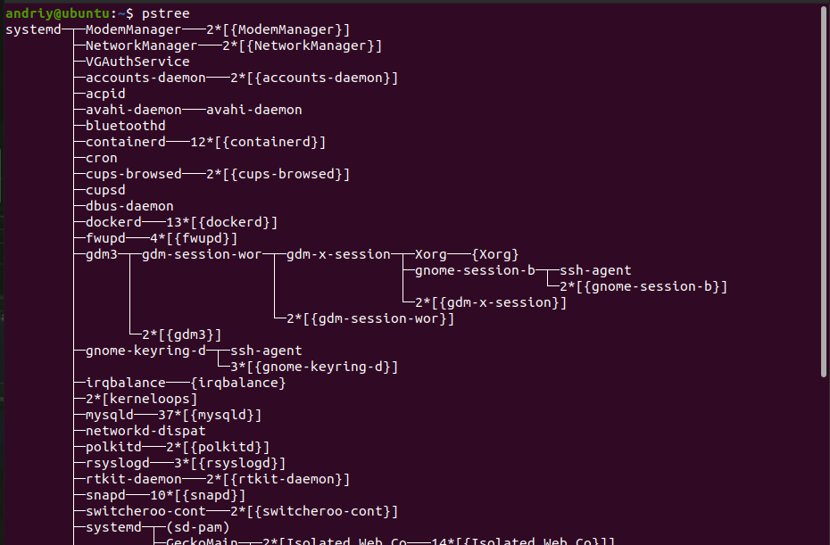

3. What is a proc file system?
Proc file system (procfs) is virtual file system created on fly when system boots and is dissolved at time of system shut down.It contains useful information about the processes that are currently running, it is regarded as control and information center for kernel

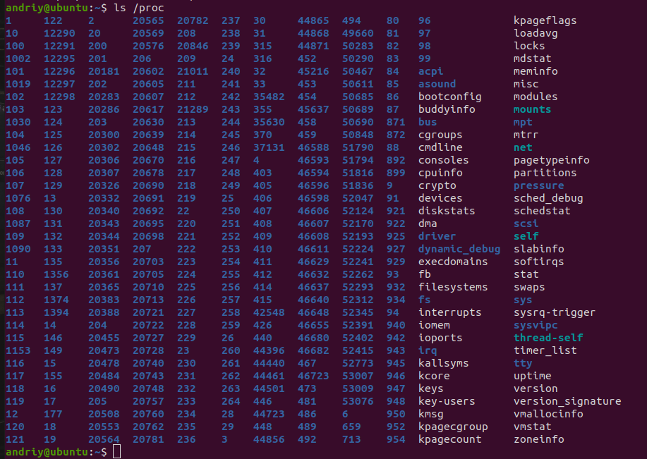

4. Print information about the processor (its type, supported technologies, etc.).
"cat /proc/cpuinfo"
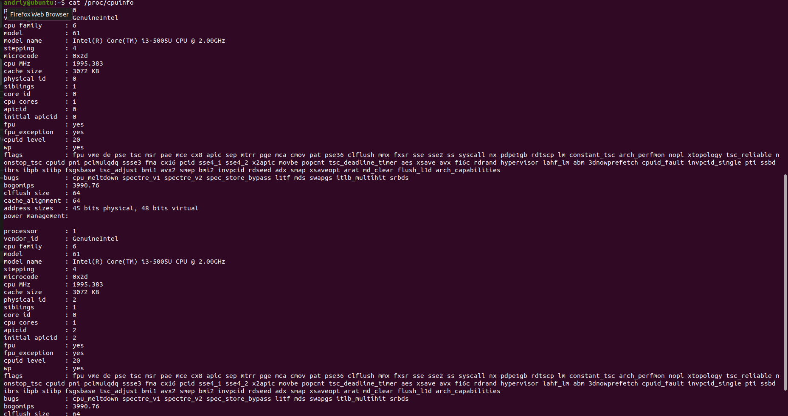

5. Use the ps command to get information about the process. The information should be as follows: the owner of the process, the arguments with which the process was launched for execution, the group owner of this process, etc.
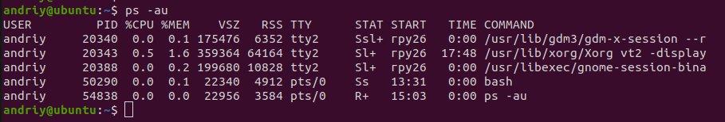

6. How to define kernel processes and user processes?
Karnel processes is a processes born by Kthread(id=2)
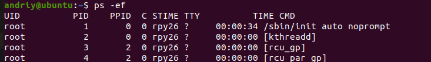
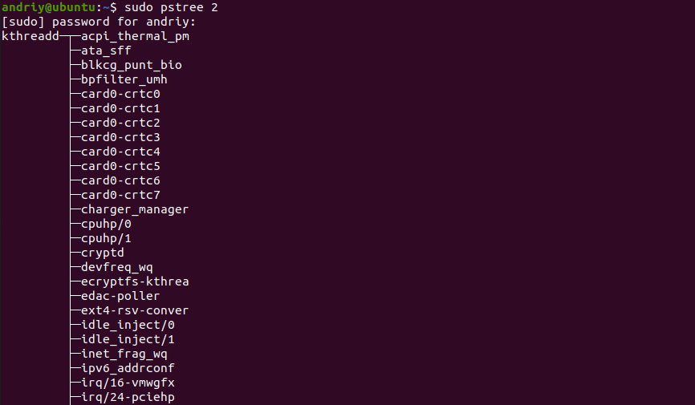

7. Print the list of processes to the terminal. Briefly describe the statuses of the processes. What condition are they in, or can they be arriving in?
"ps -aux"
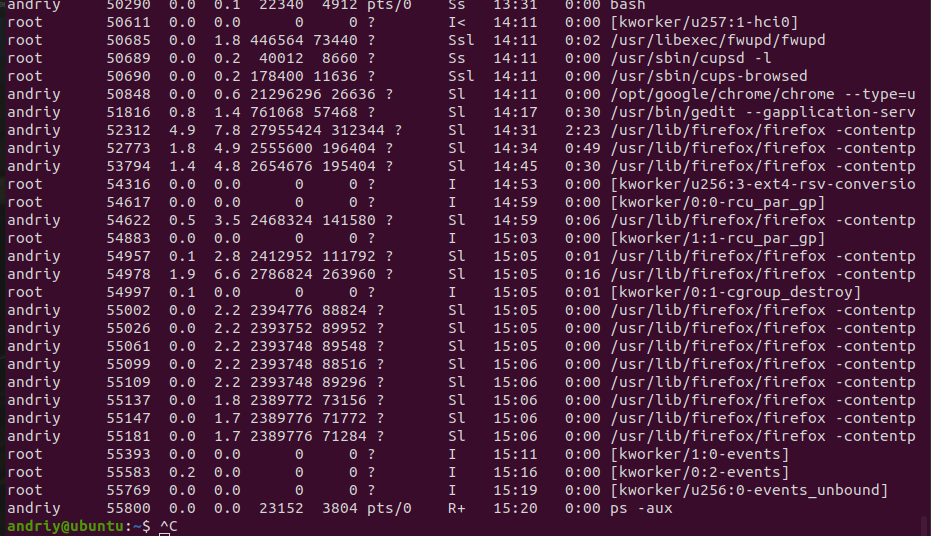

8. Display only the processes of a specific user.
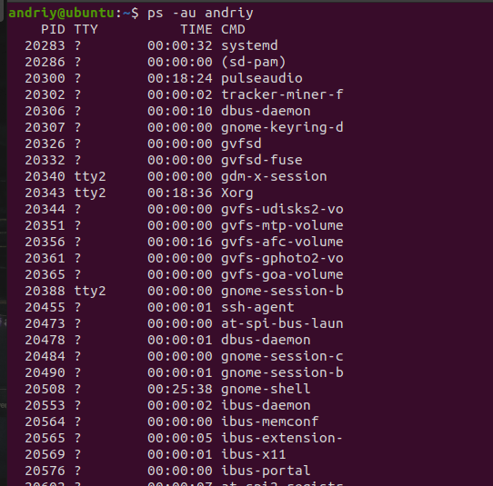

9. What utilities can be used to analyze existing running tasks (by analyzing the help for the ps
command)?
In man ps we see the next pgep  pstree top proc
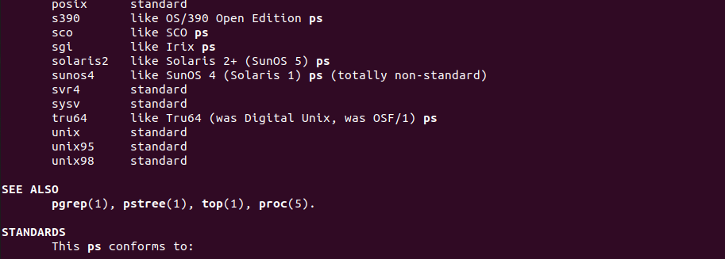

10. What information does top command display?
display information about the system, as well as a list of processes dynamically updating information about the resources they consume.
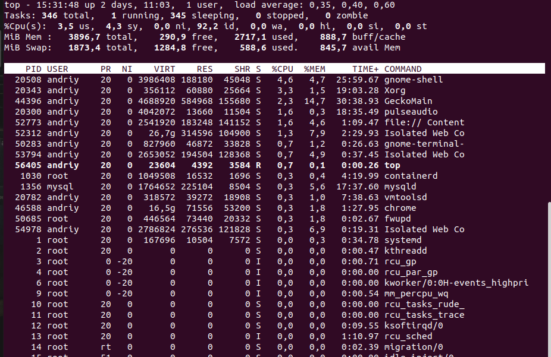

11. Display the processes of the specific user using the top command.
"top - u username"
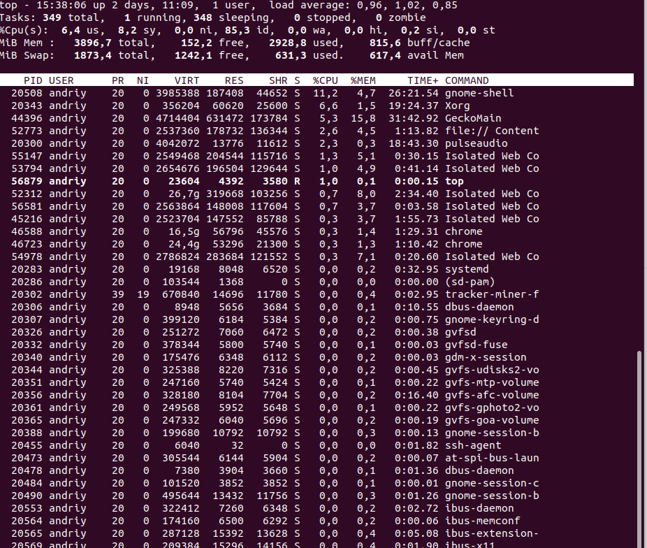

12. What interactive commands can be used to control the top command? Give a couple of
examples.

interactive commands that you can execute 
                    

    >h - output of the certificate of usefulness;
    
    >q or Esc - top output;
    
    >A - choice of color scheme;
    
    >d or s - change the update interval of information;
    
    >H - output process flows;
    
    >k - send a signal to complete the process;
    
    >W - write the current program settings in the configuration file;
    
    >Y - view additional summaries of the process, open files, ports, logs, etc .;
    
    >Z - change the color scheme;
    
    >l - hide or display information about the average load on the system;
    
    >m - disable or switch the memory display mode;
    
    >x - selects the fat column on which sorting is performed;
    
    >y - is allocated by fatty processes which are carried out at present;
    
    >z - switching between color and monochrome modes;
    
    >c - switching the command output mode, full path available and only the command;
    
    >F - setting up fields with process information;
    
    >o - filtering processes by production condition;
    
    >u - filter processes by username;
    
    >V - display of processes in the form of a tree;
    >i - switching the display mode of processes that do not currently use CPU resources;
    >n - the maximum number of processes to display in the program;
    >L - word search;
    > "<>" - move the sort field to the right and left;

13. Sort the contents of the processes window using various parameters (for example, the
amount of processor time taken up, etc.)

shift + M (by memory )
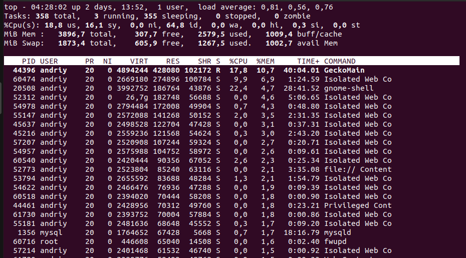

shift + T (by Time  )
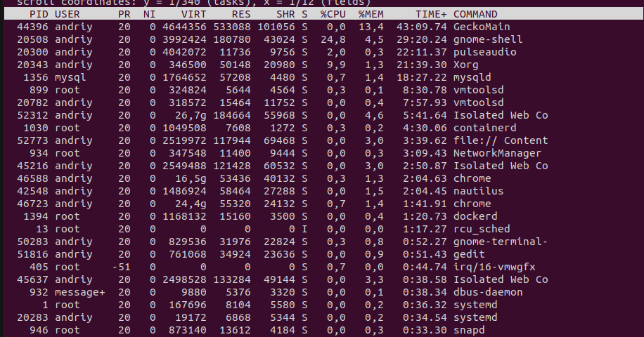

14. Concept of priority, what commands are used to set priority?

Process Priorty IN LINUX IS HOW MANY CPU TIME WILL BE GIVEN FOR PROCESSCOMPERED TO ATHER. (-20)- max priority (+20) min priority

COMANDS:
nice - set priority 
renice - set prioryty for rxistimg process (use PID)

15. Can I change the priority of a process using the top command? If so, how?

yes you can 
use "r" key 

16. Examine the kill command. How to send with the kill command
process control signal? Give an example of commonly used signals.
Syntax:

$kill pid

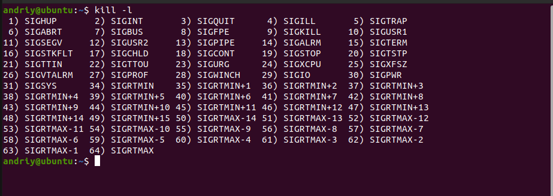

Signals can be specified in three ways:

    By number (e.g. -5)
    With SIG prefix (e.g. -SIGkill)
    Without SIG prefix (e.g. -kill)

17. Commands jobs, fg, bg, nohup. What are they for? Use the sleep, yes command to demonstrate the process control mechanism with fg, bg.

You can view running interpreter tasks with the "jobs" command

"nohup" This command allows you to run processes that will be detached from the terminal if the terminal is closed.

fg <task_number> brings the process to the forefront,

bg <task_number> - takes the process to the background.

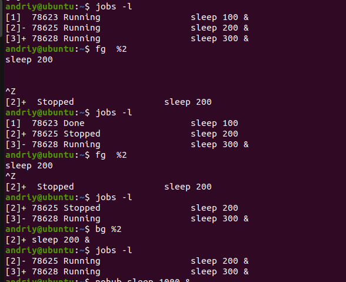

#Part2

1. Check the implementability of the most frequently used OPENSSH commands in the MS
Windows operating system. (Description of the expected result of the commands +
screenshots: command – result should be presented)

2. Implement basic SSH settings to increase the security of the client-server connection (at least

3. List the options for choosing keys for encryption in SSH. Implement 3 of them.

4. Implement port forwarding for the SSH client from the host machine to the guest Linux
virtual machine behind NAT.

5. Intercept (capture) traffic (tcpdump, wireshark) while authorizing the remote client on the
server using ssh, telnet, rlogin. Analyze the result.
