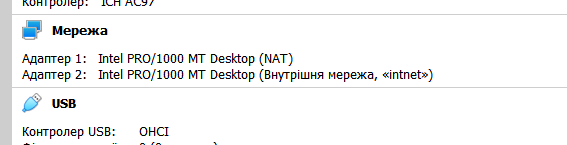
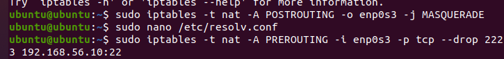
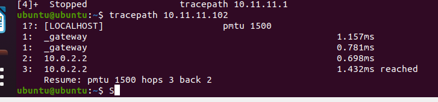
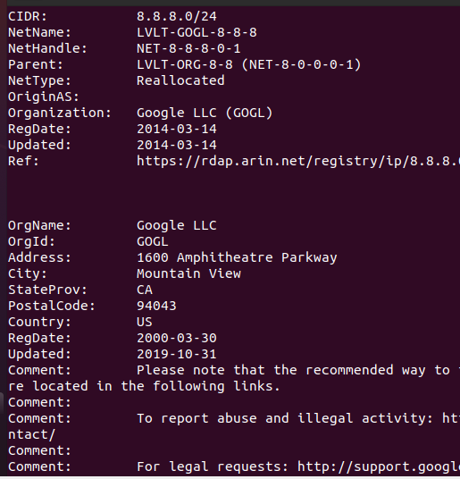
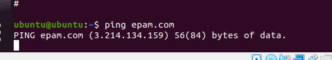
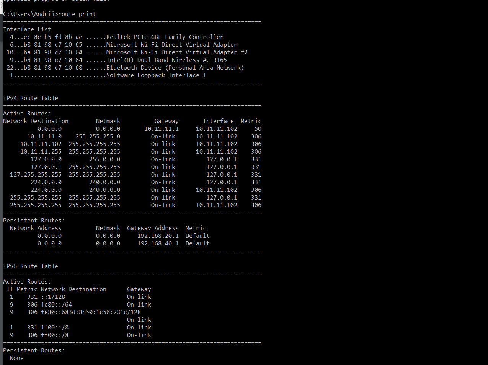

I created 2 VM and network according to the task

network adapter VM1(192.168.56.1)

network adapters VM2(192.168.56.10)

ip tables on VM1

tracepath from VM2 to host 

on my VMs didn`t work ping comand but internet is there 
 

i used `whois ` comand to  8.8.8.8  -- it is google dns server

for identify  ip epam.com I used ping comand 

here you can see routing tables and gateway of my Windows host
